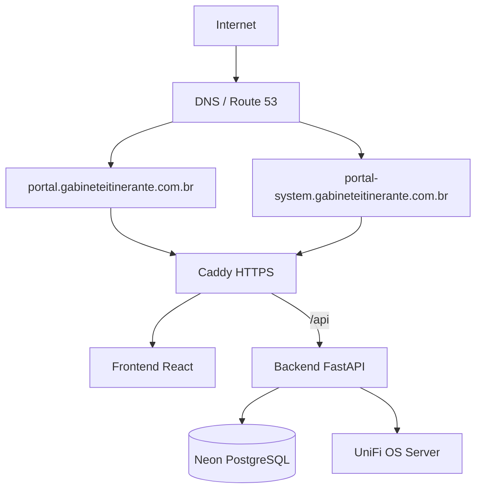
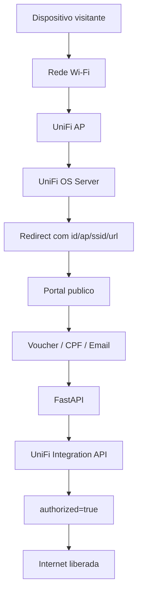
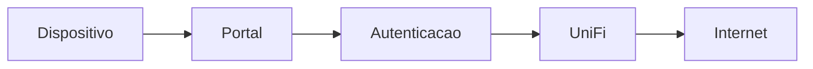
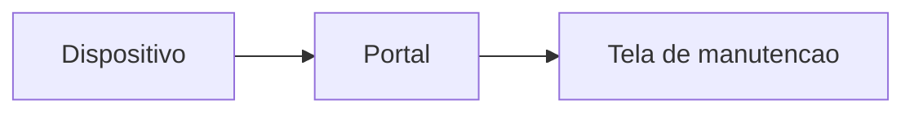
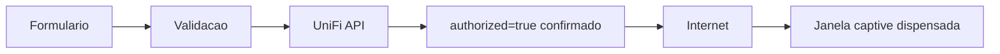
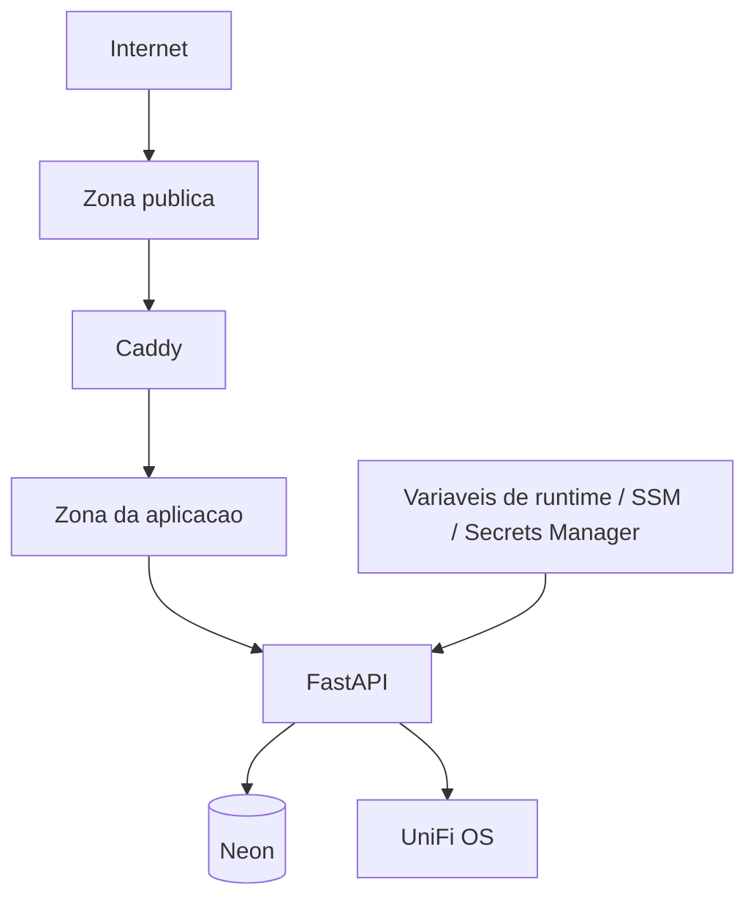

# Captive Portal

Este repositório contém a aplicação de Captive Portal externo para redes UniFi do Gabinete Itinerante.

O usuário da rede acessa o portal público em `https://portal.gabineteitinerante.com.br`. A administração usa `https://portal-system.gabineteitinerante.com.br`. Os dois hostnames apontam para a mesma EC2, passam pelo mesmo Caddy e compartilham o mesmo backend FastAPI.

## Objetivo

A aplicação recebe o redirecionamento do Captive Portal da UniFi, identifica o dispositivo visitante, coleta o método de autenticação necessário e só libera a navegação depois que o UniFi confirma `authorized=true` para o cliente.

O portal deve funcionar bem em Android, iPhone e computador, inclusive dentro das janelas reduzidas de captive portal abertas pelo sistema operacional.

## Funcionalidades

- Autenticação por voucher, CPF ou email.
- Aceite obrigatório dos termos de uso antes da autorização.
- Autorização de visitantes pela UniFi Network Integration API.
- Confirmação real de `authorized=true` antes de mostrar sucesso.
- Tela final curta com botão `Continuar para Internet` como fallback.
- Acompanhamento de sessão com horário de autorização, expiração, tempo total e tempo restante.
- Avisos internos quando a sessão estiver próxima de expirar.
- Modo manutenção imediato ou programado.
- Comunicados públicos por tipo e por site.
- Painel administrativo protegido por RBAC, cookie HttpOnly e CSRF.
- Vouchers com limites de tempo, dados, velocidade, dispositivos, site, validade e status.
- Banco Neon PostgreSQL com migrations Alembic.
- Caddy como proxy HTTPS para os dois hostnames.

## Arquitetura



## Fluxo do Captive Portal



## Experiência do Usuário

### Estado Normal



### Manutenção



### Autorização



## Segurança



Pontos principais:

- Senhas administrativas usam Argon2id.
- Sessão administrativa usa cookie HttpOnly e Secure em produção.
- CSRF usa cookie separado e header `X-CSRF-Token`.
- Tokens administrativos não devem ser armazenados em `localStorage`.
- CPF, email, telefone e IP são tratados como dados pessoais.
- CORS deve listar apenas `https://portal.gabineteitinerante.com.br` e `https://portal-system.gabineteitinerante.com.br`.
- Produção não deve usar SQLite, MySQL, secrets padrão ou `UNIFI_VERIFY_SSL=false`.

## Estrutura de Pastas

- `backend/`: API FastAPI, models, schemas, serviços, integrações, Alembic e testes.
- `frontend/`: aplicação React/Vite exibida nos hostnames público e administrativo.
- `caddy/`: configuração Caddy para HTTPS e roteamento dos dois hostnames.
- `scripts/`: scripts operacionais de migração, backup, healthcheck, deploy e criação de admin.
- `docs/`: documentação de arquitetura, AWS, Neon, segurança, retenção e UniFi.
- `legacy/`: referência antiga ignorada pelo Git; não faz parte do build novo.

## Configuração

A aplicação usa variáveis de ambiente. O arquivo `.env.example` mostra os nomes esperados e deve continuar sem valores reais.

Para preparar um ambiente local ou de produção:

```bash
cp .env.example .env
```

Depois disso, preencher `.env` com valores reais no servidor ou carregar os valores a partir de SSM Parameter Store/Secrets Manager. O arquivo `.env` real não deve ser commitado.

## Execução com Docker

Na EC2, o diretório recomendado é `/opt/portal`.

```bash
cd /opt/portal
docker compose build
./scripts/migrate.sh
cd backend
python -m app.cli create-admin
cd ..
docker compose up -d
docker compose ps
```

O FastAPI não fica exposto publicamente. O acesso externo acontece apenas pelas portas `80` e `443` publicadas pelo Caddy.

## Testes

Backend:

```bash
cd backend
pytest tests
ruff check app tests
mypy app
bandit -r app
```

Frontend:

```bash
cd frontend
npm ci
npm run build
npm run lint
npm audit --audit-level=high
```

## Observações Sobre UniFi

A aplicação usa a UniFi Network Integration API com `X-API-Key`. Para autorização de visitantes, são usados os endpoints de sites, clientes e ações de cliente.

Os limites avançados de voucher só são enviados ao UniFi quando existem campos documentados pela API oficial:

- `timeLimitMinutes`
- `dataUsageLimitMBytes`
- `rxRateLimitKbps`
- `txRateLimitKbps`

Regras como `max_devices`, `site`, `enabled` e `expires_at` são aplicadas pelo próprio portal e pelo banco de dados.

## Checklist Antes de Produção

- DNS dos dois hostnames apontando para a EC2 do portal.
- Caddy obtendo certificados HTTPS válidos.
- `.env` real fora do Git.
- `DATABASE_URL` usando usuário runtime do Neon.
- `MIGRATION_DATABASE_URL` usando usuário owner apenas para Alembic.
- `UNIFI_BASE_URL`, `UNIFI_API_PREFIX` e `UNIFI_API_KEY` configurados.
- `UNIFI_VERIFY_SSL=true`.
- Grupo de Segurança expondo somente `80/tcp`, `443/tcp` e administração restrita.
- Admin inicial criado por `python -m app.cli create-admin`.
- Testes backend e frontend passando.

## Solução de Problemas

- `health/ready` degradado: verificar conexão com Neon e variáveis de ambiente.
- Autorização UniFi falhando: verificar API key, URL, prefixo, site e se o cliente aparece no UniFi.
- Janela captive não fecha automaticamente: isso depende do Android/iOS; o botão `Continuar para Internet` serve como fallback.
- Erro de CORS em produção: conferir `ALLOWED_ORIGINS` com os dois hostnames HTTPS definitivos.