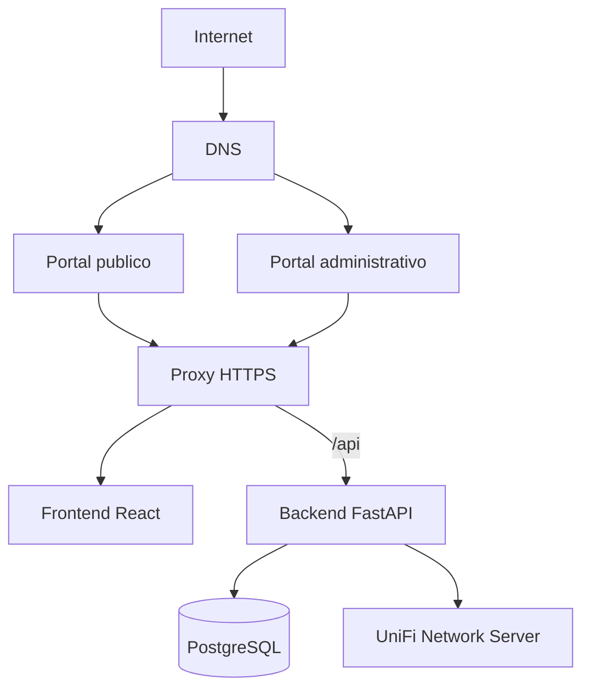
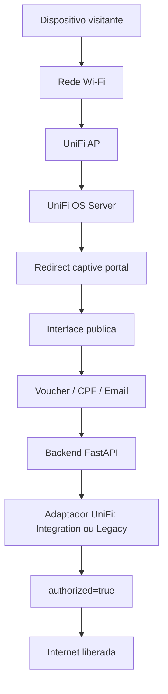
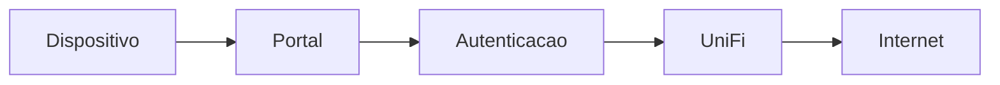
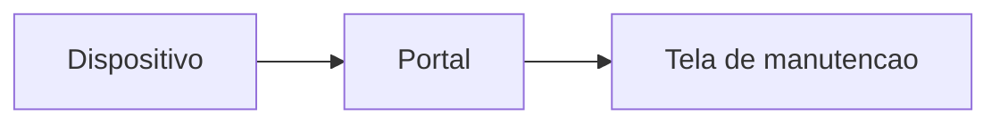
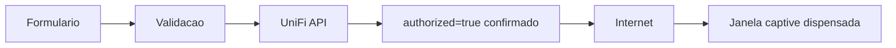
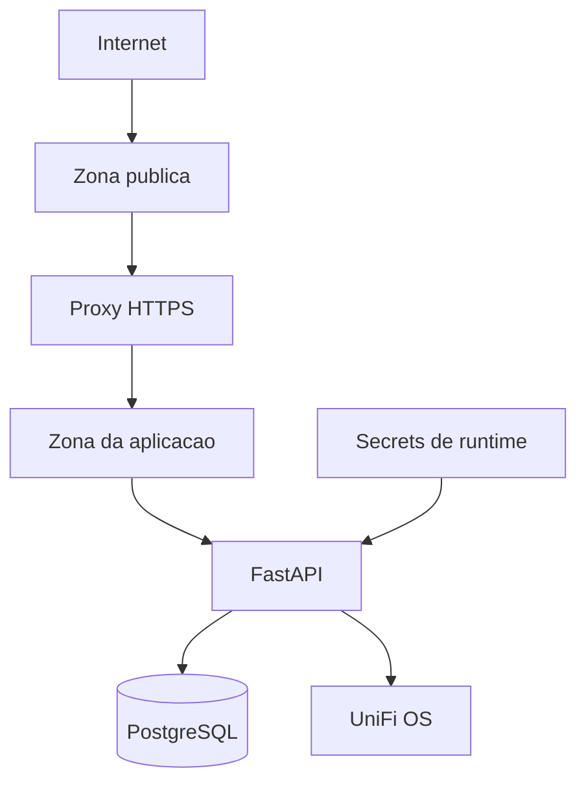

# Captive Portal

Este repositório contém a aplicação de Captive Portal externo para redes UniFi do Gabinete Itinerante.

A solução possui uma interface pública para visitantes e uma interface administrativa separada por hostname. As duas entradas podem apontar para a mesma instalação local, passam pelo mesmo proxy e compartilham o mesmo backend FastAPI. O ambiente do Posto Esdras usa Windows, Cloudflare Tunnel e Neon.

## Objetivo

A aplicação recebe o redirecionamento do Captive Portal da UniFi, identifica o dispositivo visitante, coleta o método de autenticação necessário e libera a navegação somente depois que o UniFi confirma `authorized=true` para o cliente.

A experiência foi pensada para Android, iPhone e computador, incluindo as janelas reduzidas de captive portal abertas pelo sistema operacional.

## Funcionalidades

- Autenticação por voucher, CPF ou email.
- Aceite obrigatório dos termos de uso antes da autorização.
- Autorização de visitantes pela UniFi Network Integration API ou pela API clássica do UniFi Network Server.
- Confirmação real de `authorized=true` antes da tela de sucesso.
- Tela final curta com fallback para continuar navegando.
- Acompanhamento de sessão com autorização, expiração, tempo total e tempo restante.
- Avisos internos quando a sessão estiver próxima de expirar.
- Modo manutenção imediato ou programado.
- Comunicados públicos por tipo e por site.
- Painel administrativo com RBAC, cookie HttpOnly e CSRF.
- Vouchers com limites de tempo, dados, velocidade, dispositivos, site, validade e status.
- Banco PostgreSQL gerenciado com migrations Alembic.
- Proxy HTTPS para separar interface pública, interface administrativa e API.

## Arquitetura



## Fluxo do Captive Portal



## Experiência do Usuário

### Estado Normal



### Manutenção



### Autorização



## Segurança



A autenticação administrativa usa cookies HttpOnly e proteção CSRF. Senhas são armazenadas com Argon2id. Dados como CPF, email, telefone e IP são tratados como dados pessoais e devem seguir a política de retenção definida para o projeto.

Em produção, CORS deve ser explícito para os hostnames oficiais da aplicação. A aplicação também bloqueia configurações inseguras como secrets padrão, banco local de desenvolvimento e verificação SSL desativada para UniFi.

## Estrutura de Pastas

- `backend/`: API FastAPI, models, schemas, serviços, integrações, Alembic e testes.
- `frontend/`: aplicação React/Vite exibida nas interfaces pública e administrativa.
- `caddy/`: configuração do proxy HTTPS e roteamento interno.
- `scripts/`: scripts operacionais de migração, backup, healthcheck, deploy e criação de admin.
- `docs/`: documentação de arquitetura, AWS, Neon, segurança, retenção e UniFi.
- `legacy/`: referência antiga ignorada pelo Git; não faz parte do build novo.

## Configuração

A aplicação usa variáveis de ambiente para separar código e configuração. O arquivo `.env.example` documenta os nomes esperados e deve permanecer sem valores reais.

O arquivo `.env` real pertence ao ambiente de execução e não deve ser versionado. Em produção, os valores podem ser carregados por arquivo protegido, SSM Parameter Store ou Secrets Manager.

## Execução

O projeto suporta Docker Compose e também execução local no Windows. No Posto Esdras, FastAPI e Caddy rodam como serviços do Windows em loopback e o acesso externo entra exclusivamente pelo Cloudflare Tunnel.

Fluxo operacional esperado:

```bash
docker compose build
./scripts/migrate.sh
cd backend
python -m app.cli create-admin
cd ..
docker compose up -d
docker compose ps
```

O backend FastAPI não é exposto diretamente à Internet. O tráfego externo entra pelo proxy HTTPS e chega ao backend apenas pelas rotas internas de API.

## Testes

Backend:

```bash
cd backend
pytest tests
ruff check app tests
mypy app
bandit -r app
```

Frontend:

```bash
cd frontend
npm ci
npm run build
npm run lint
npm audit --audit-level=high
```

## Integração UniFi

A integração UniFi possui dois modos: `integration`, usando API key da Network Integration API, e `legacy`, usando uma conta técnica local, cookie de sessão e os endpoints clássicos do UniFi Network Server. Em ambos os casos o backend consulta novamente o cliente antes de concluir a sessão como liberada.

No modo `integration`, a autorização usa os campos da API oficial. No modo `legacy`, o adaptador traduz tempo, limites de dados e velocidade para o comando clássico de autorização de guest. Regras administrativas de voucher, como quantidade máxima de dispositivos, site, validade e status ativo, continuam sendo aplicadas pelo próprio portal e registradas no banco.

## Prontidão Para Produção

A aplicação é considerada pronta para produção quando o ambiente possui DNS, HTTPS, banco PostgreSQL, integração UniFi, secrets de runtime e painel administrativo inicial configurados fora do repositório.

Também fazem parte da prontidão: backend isolado da Internet, grupo de segurança mínimo, migrations aplicadas, testes automatizados passando e validação real do fluxo captive portal em dispositivos móveis e desktop.

## Operação

Health checks indicam a disponibilidade básica da aplicação e a prontidão das dependências. Falhas de prontidão normalmente estão relacionadas a banco, variáveis de ambiente ou integração externa.

A janela captive portal é controlada pelo sistema operacional do dispositivo. Depois da confirmação de acesso, o portal mostra uma tela curta de sucesso e oferece fallback manual para continuar navegando caso Android ou iOS não dispensem a janela automaticamente.

## Windows / Posto Esdras

A implantação local, serviços automáticos, configuração do modo UniFi legado e roteiro de migração da AWS estão documentados em `docs/WINDOWS_ESDRAS.md`.
