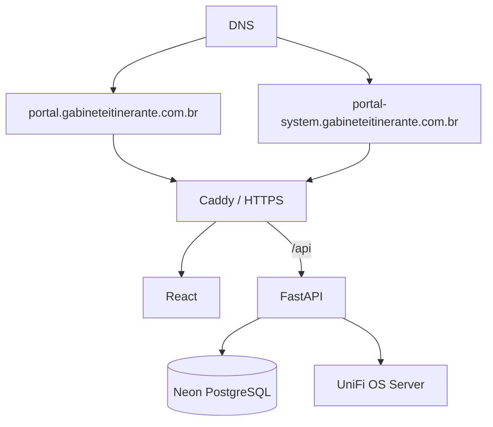

# Arquitetura

A aplicação roda em uma EC2 Ubuntu dedicada ao Captive Portal. O Caddy recebe o tráfego HTTPS dos dois hostnames e encaminha as requisições para os serviços internos.

- `portal.gabineteitinerante.com.br`: interface pública do visitante.
- `portal-system.gabineteitinerante.com.br`: painel administrativo.
- `frontend`: aplicação React servida internamente.
- `backend`: FastAPI disponível apenas na rede interna do Docker.
- `Neon PostgreSQL`: banco de dados externo.
- `UniFi OS Server`: servidor UniFi em outra EC2.

## Organização do Backend

O backend fica separado por responsabilidade:

- `api/`: rotas públicas, administrativas e health checks.
- `core/`: configuração, banco e logging.
- `models/`: entidades SQLAlchemy.
- `schemas/`: contratos Pydantic de entrada e saída.
- `services/`: regras de negócio compartilhadas.
- `security/`: senha, tokens e criptografia de dados pessoais.
- `integrations/`: clientes externos, como UniFi e email.
- `alembic/`: migrations de banco.
- `tests/`: testes automatizados.

## Decisões Importantes

O FastAPI não deve receber tráfego público direto. Todo acesso externo passa pelo Caddy.

O banco não é criado automaticamente na inicialização da aplicação. Alterações de schema devem passar por Alembic.

O backend é a fonte de verdade para autorização, expiração e estado da sessão. O frontend só apresenta countdown visual.